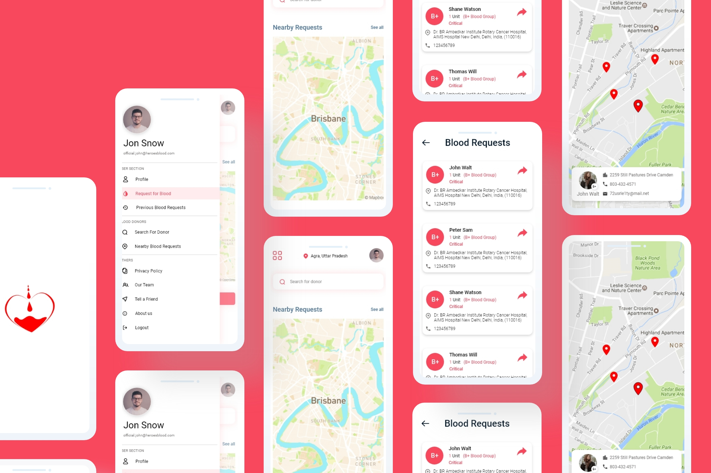
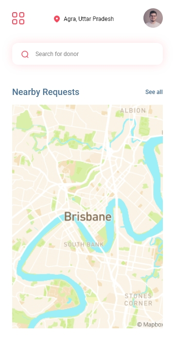
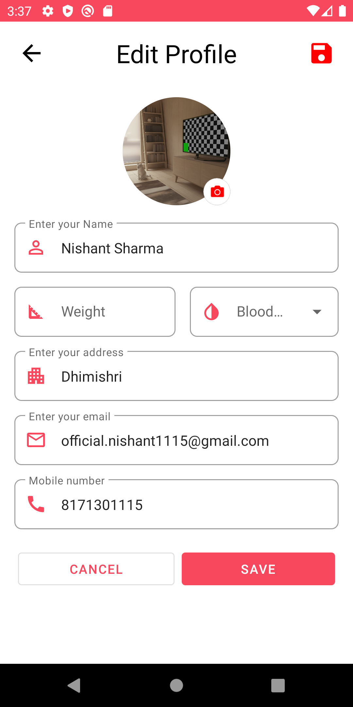
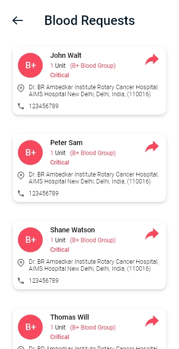
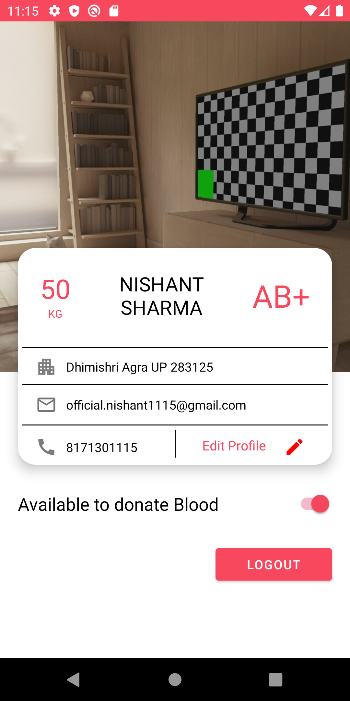

# **Heroes Blood** 

**Heroes Blood** is a Blood donation Android application 📱 built using *Modern Android development* tools.

## **Currently in alpha version**🛠

## 📸 Screenshots

||||
|:----------------------------------------:|:-----------------------------------------:|:-----------------------------------------: |
|  |  |  |
|  |  |  |

## Built With 🛠
- [Kotlin](https://kotlinlang.org/) - First class and official programming language for Android development.
- [Coroutines](https://kotlinlang.org/docs/reference/coroutines-overview.html) - For asynchronous and more.
- [Android Architecture Components](https://developer.android.com/topic/libraries/architecture) - Collection of libraries that help you design robust, testable, and maintainable apps.
  - [LiveData](https://developer.android.com/topic/libraries/architecture/livedata) - Data objects that notify views when the underlying database changes.
  - [ViewModel](https://developer.android.com/topic/libraries/architecture/viewmodel) - Stores UI-related data that isn't destroyed on UI changes. 
  - [ViewBinding](https://developer.android.com/topic/libraries/view-binding) - Generates a binding class for each XML layout file present in that module and allows you to more easily write code that interacts with views.
  - [DataBinding](https://developer.android.com/topic/libraries/data-binding) - Binds data directly into XML layouts
- [Backend](https://firebase.google.com) - Google Firebase
  - Firebase Auth - To support email based authentication
  - Firebase Firestore - A NoSQL database to store all data 
  - Firebase Storage - A cloud storage to store all images
- [Retrofit](https://square.github.io/retrofit/) - A type-safe HTTP client for Android and Java.
- [Google Map SDk](https://developers.google.com/maps/documentation/android-sdk/start) - The Google Maps Api helps us to lay down the map into our Android App. It can have different types of map like satellite, terrain and many more. Adding these features on the map helps us to add cool features to our app and make our app able to guide to places to which the user wants.
- [GSON](https://github.com/google/gson) - A modern JSON library for Kotlin and Java.
- [GSON Converter](https://github.com/square/retrofit/tree/master/retrofit-converters/gson) - A Converter which uses GSON for serialization to and from JSON.
- [Coil](http://github.com/coil-kt/coil) - An image loading library for Android backed by Kotlin Coroutines.
- [Material Components for Android](https://github.com/material-components/material-components-android) - Modular and customizable Material Design UI components for Android.
- [Facebook Shimmer Effect](http://facebook.github.io/shimmer-android/) - It is useful as an unobtrusive loading indicator that was originally developed for Facebook Home, that used as a placeholder for data when data is loading from remote source(Firebase) for Android.

# Package Structure
    
    com.nishant.heorsblood  # Root Package
    .
    ├── model                               # For holding data for views.
    |
    ├── repositories                        # Repository to interct with firebase             
    │   ├── AuthRepository                  # To interct with Firebase Authentication
    |   └── DataRepository                  # To interct with Firebase Firestore and Firebase Storage 
    |
    ├── ui                                  # UI/View layer
    │   ├── fragments                       # Contain fragments
            └── signup                      # Contain fragments used in signup navgraph
    │   ├── DonorListActivity               # Show list of specific donors
    |   ├── DonorLocationMapActivity        # Show Live location of donor on google map
    |   ├── DonorProfileActivity            # Show donor profile
    │   ├── EditUserProfileActivity         # Logged in user can change their profile
    │   ├── IntroScreenActivity             # on boarding screen
    |   ├── LoginActivity                   # User can login
    |   ├── SignUpActivity                  # Sign up activity that contain navHostFragment
    │   ├── UserDashboardActivity           # Dashboard activity
    |   ├── UserProfileActivity             # user profile activity
    |   └── UserRegistrationActivity        # User can register for donation
    |
    ├── utils                               # Utility Classes / Kotlin extensions
    |
    └── viewmodels                          # viewmodels to provide model to views
        ├── AuthViewModel                   # To handle authenticated related things
        └── DataViewModel                   # To handle data 
    

## Architecture
This app uses [***MVVM (Model View View-Model)***](https://developer.android.com/jetpack/docs/guide#recommended-app-arch) architecture.

  
 ## Contact
If you need any help, you can connect with me.

Visit:- [Nishant Sharma](https://nishantsharma1115.github.io) | [LinkedIn](https://linkedin.com/in/nishantsharma1115) | [Instagram](https://www.instagram.com/_ni5hant_/) | [Facebook](https://www.facebook.com/nishant1115/)
